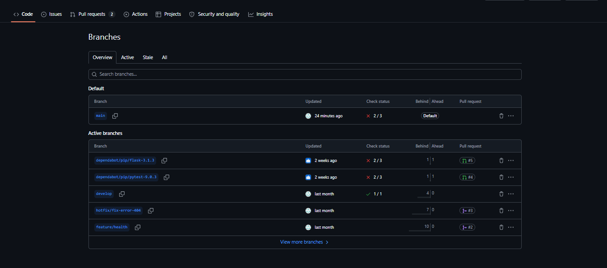
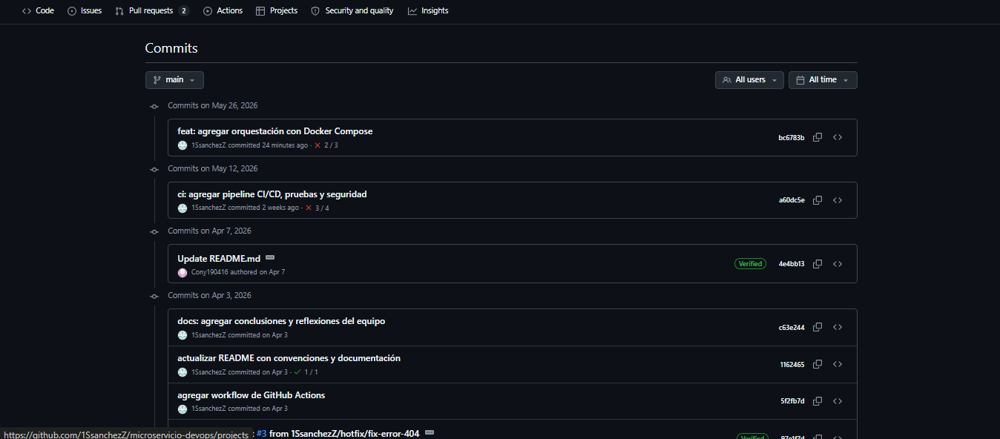
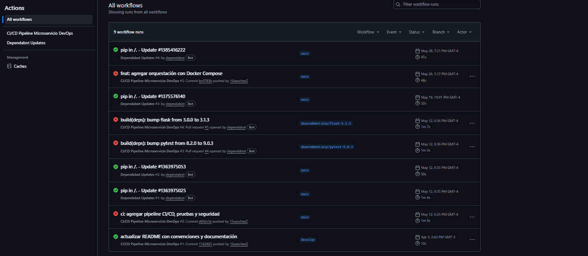
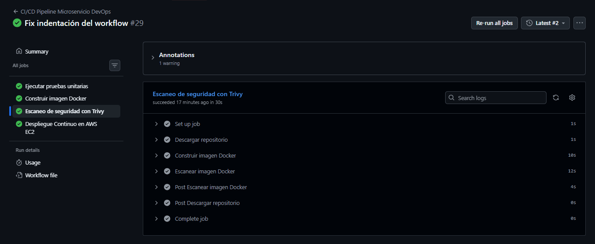
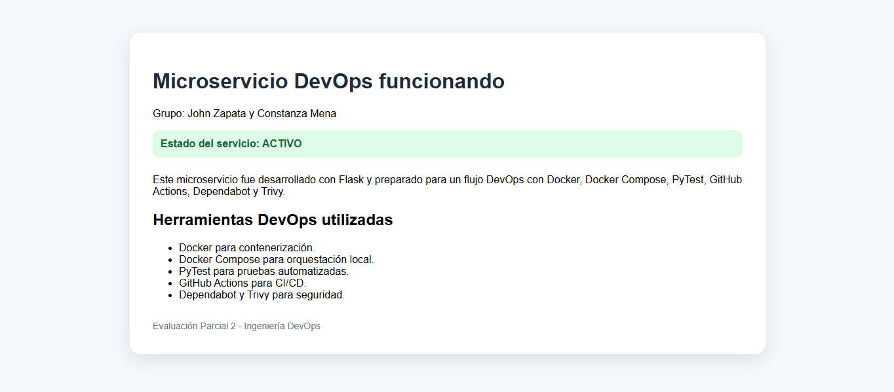
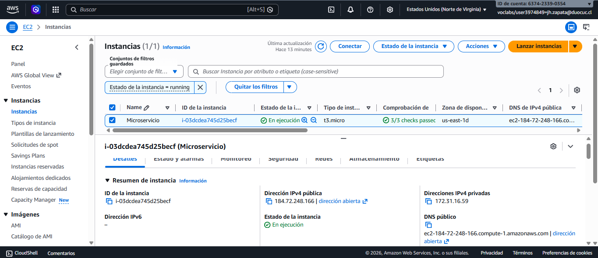
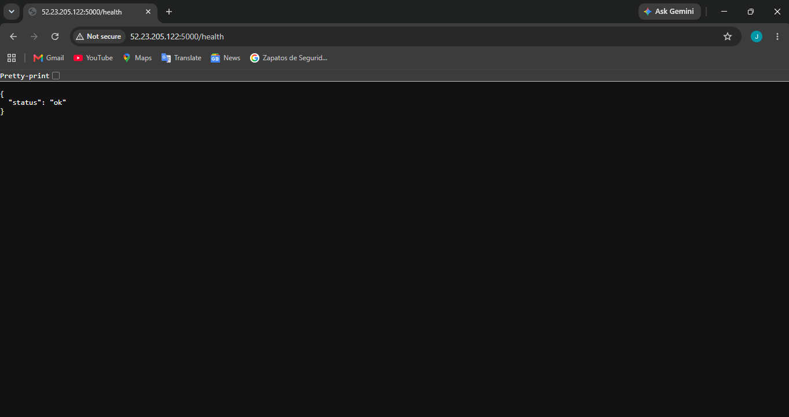
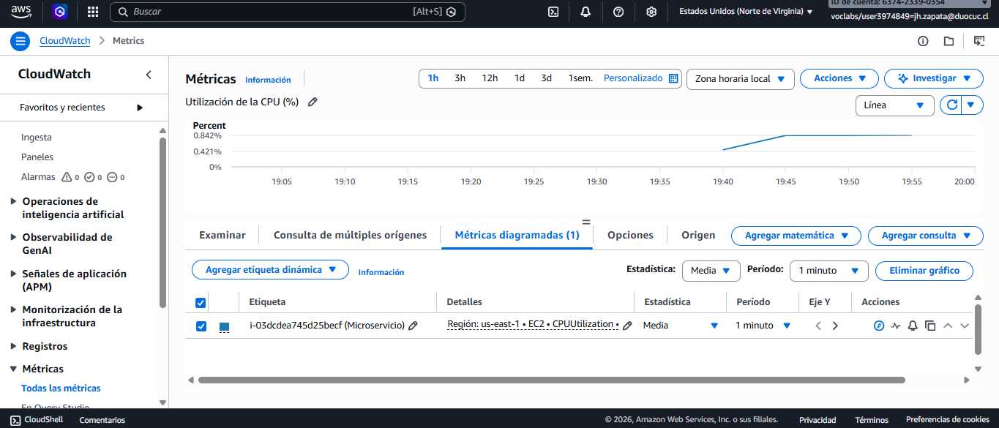

# Microservicio DevOps

**Evaluación Parcial 3 – Ingeniería DevOps**

---

# Descripción del proyecto

Este repositorio contiene el desarrollo de un microservicio implementado con **Python** y **Flask**, utilizado como base para aplicar e integrar prácticas modernas de **DevOps** y **DevSecOps**. A lo largo del proyecto se diseñó e implementó un flujo de trabajo automatizado que permitió validar, construir, analizar y desplegar la aplicación utilizando herramientas ampliamente utilizadas en la industria.

Durante la evaluación se implementó un proceso de **Integración Continua (CI)** mediante **GitHub Actions**, el cual ejecuta automáticamente pruebas unitarias con **PyTest**, construye una imagen Docker y realiza un análisis de vulnerabilidades utilizando **Trivy** antes de permitir el despliegue de la aplicación.

Posteriormente, se implementó un proceso de **Despliegue Continuo (CD)** hacia una instancia **Amazon EC2**, donde el pipeline se conecta de forma segura mediante **SSH**, actualiza el repositorio del proyecto, reconstruye la imagen Docker y despliega automáticamente una nueva versión del microservicio dentro de un contenedor.

Como complemento al proceso de despliegue, se configuró el servicio **Amazon CloudWatch** para monitorear el estado de la infraestructura, recopilando métricas de utilización de CPU, memoria y almacenamiento mediante el **CloudWatch Agent**, permitiendo supervisar el comportamiento del servidor en tiempo real.

El resultado corresponde a un entorno completamente automatizado que integra control de versiones, pruebas, contenerización, análisis de seguridad, despliegue continuo y monitoreo de infraestructura, siguiendo las buenas prácticas propuestas por la cultura DevOps.

---

# Tecnologías utilizadas

| Tecnología | Descripción |
|------------|-------------|
| Python 3.11 | Lenguaje de programación utilizado para desarrollar el microservicio. |
| Flask | Framework utilizado para la construcción del microservicio y la interfaz web. |
| Docker | Contenerización del microservicio para garantizar portabilidad y consistencia entre ambientes. |
| Git | Sistema de control de versiones distribuido. |
| GitHub | Plataforma utilizada para alojar y gestionar el repositorio del proyecto. |
| GitHub Actions | Automatización del pipeline de Integración Continua y Despliegue Continuo (CI/CD). |
| PyTest | Framework utilizado para la ejecución de pruebas unitarias automatizadas. |
| Trivy | Herramienta utilizada para el análisis de vulnerabilidades de la imagen Docker. |
| Amazon EC2 | Servicio de AWS utilizado para alojar el microservicio en un entorno de producción. |
| Amazon CloudWatch | Plataforma de monitoreo utilizada para visualizar métricas de la infraestructura. |
| Amazon CloudWatch Agent | Agente instalado en la instancia EC2 para recopilar métricas de CPU, memoria y disco. |
| SSH | Protocolo utilizado para realizar el despliegue remoto desde GitHub Actions hacia la instancia EC2. |

# Estrategia de ramificación

Durante el desarrollo del proyecto se evaluaron diferentes estrategias de ramificación para gestionar el código fuente y facilitar el trabajo colaborativo. Entre las metodologías analizadas se encuentran GitFlow, GitHub Flow y Trunk-Based Development.

## GitFlow

GitFlow es un modelo de trabajo que organiza el desarrollo mediante ramas con propósitos específicos, permitiendo separar el código estable del código en desarrollo. Este modelo facilita la integración de nuevas funcionalidades, la corrección de errores y la preparación de nuevas versiones del software.

## GitHub Flow

GitHub Flow propone un flujo de trabajo más simple, basado en una rama principal (`main`) y ramas temporales para desarrollar nuevas funcionalidades antes de integrarlas mediante Pull Requests.

## Trunk-Based Development

Trunk-Based Development consiste en integrar continuamente los cambios directamente sobre una rama principal, promoviendo ciclos de desarrollo cortos y una integración constante.

## Justificación de la estrategia seleccionada

Para este proyecto se seleccionó **GitFlow**, ya que permitió mantener una separación clara entre el código en desarrollo y el código listo para producción. Esta estrategia facilitó la implementación del pipeline de Integración Continua y Despliegue Continuo (CI/CD), permitiendo validar automáticamente cada cambio antes de su despliegue hacia la instancia Amazon EC2.

Asimismo, GitFlow proporcionó una mejor organización del desarrollo, simplificando la incorporación de nuevas funcionalidades, la corrección de errores y el mantenimiento del historial de cambios mediante commits estructurados.

# Ramas utilizadas

Durante el desarrollo del proyecto se utilizaron las siguientes ramas:

| Rama | Propósito |
|-------|-----------|
| `main` | Contiene la versión estable del proyecto y es utilizada para el despliegue automático en Amazon EC2. |
| `develop` | Rama destinada a la integración y validación de nuevas funcionalidades antes de incorporarlas a la rama principal. |

El desarrollo consistió en implementar mejoras progresivas sobre la rama `develop`, las cuales posteriormente fueron integradas en `main` una vez verificadas mediante pruebas automatizadas y el pipeline de GitHub Actions.

# Convención de commits

Para mantener un historial de cambios claro y comprensible se utilizó el estándar **Conventional Commits**, permitiendo identificar rápidamente el propósito de cada modificación realizada durante el proyecto.

| Prefijo | Descripción |
|----------|-------------|
| `feat:` | Incorporación de nuevas funcionalidades. |
| `fix:` | Corrección de errores o fallas detectadas. |
| `docs:` | Actualización de la documentación del proyecto. |
| `ci:` | Cambios relacionados con el pipeline de Integración Continua y Despliegue Continuo. |
| `test:` | Incorporación o modificación de pruebas automatizadas. |
| `refactor:` | Reestructuración interna del código sin modificar su funcionamiento. |

### Ejemplos de commits utilizados durante el proyecto

```text
feat: agregar interfaz web al microservicio

test: actualizar pruebas para endpoint HTML

ci: permitir reporte de vulnerabilidades sin bloquear pipeline

docs: actualizar documentación final del proyecto

refactor: optimizar despliegue automático en Amazon EC2
```

# Flujo de trabajo colaborativo

El desarrollo del proyecto se realizó siguiendo la estrategia **GitFlow**, utilizando las ramas `develop` y `main` como base del proceso de integración y despliegue.

El flujo de trabajo utilizado fue el siguiente:

```bash
git clone https://github.com/1SsanchezZ/microservicio-devops.git

git checkout develop

git add .

git commit -m "feat: descripción del cambio"

git push origin develop

```

Una vez que los cambios son incorporados a la rama **main**, el pipeline de **GitHub Actions** ejecuta automáticamente las pruebas unitarias, construye la imagen Docker, realiza el análisis de vulnerabilidades con **Trivy** y despliega la aplicación en la instancia **Amazon EC2**.

---

# Estructura del proyecto

```text
microservicio-devops/
│
├── .github/
│   └── workflows/
│       └── ci.yml
│
├── templates/
│   └── index.html
│
├── tests/
│   └── test_app.py
│
├── app.py
├── Dockerfile
├── requirements.txt
├── README.md
└── .gitignore
```

## Descripción de los archivos principales

| Archivo o carpeta | Descripción |
|-------------------|-------------|
| `app.py` | Contiene la lógica principal del microservicio desarrollado con Flask. |
| `Dockerfile` | Define el proceso de construcción de la imagen Docker del proyecto. |
| `requirements.txt` | Lista las dependencias necesarias para ejecutar la aplicación. |
| `tests/` | Contiene las pruebas unitarias ejecutadas automáticamente mediante PyTest. |
| `templates/` | Incluye las plantillas HTML utilizadas por la aplicación web. |
| `.github/workflows/ci.yml` | Define el pipeline de Integración Continua y Despliegue Continuo (CI/CD) mediante GitHub Actions. |
| `README.md` | Documentación completa del proyecto. |
| `.gitignore` | Especifica los archivos y carpetas que no deben incorporarse al repositorio Git. |

---

# Endpoints disponibles

El microservicio expone los siguientes endpoints para validar su funcionamiento y entregar información al usuario:

| Endpoint | Método | Descripción |
|-----------|--------|-------------|
| `/` | GET | Muestra la página principal del microservicio desarrollada con Flask. |
| `/health` | GET | Permite verificar el estado del servicio, utilizado por el pipeline para validar el despliegue. |
| `/usuarios` | GET | Devuelve una lista de usuarios en formato JSON. |
| `/saludo` | GET | Retorna un mensaje de bienvenida desde el microservicio en formato JSON. |

# Docker

Docker fue utilizado para contenerizar el microservicio, permitiendo ejecutar la aplicación en un entorno aislado, portátil y consistente. La utilización de contenedores asegura que el comportamiento del sistema sea el mismo tanto durante el desarrollo como en el servidor de producción desplegado en Amazon EC2.

El proceso de despliegue implementado en GitHub Actions reconstruye automáticamente la imagen Docker cada vez que se integran cambios en la rama principal del repositorio.

## Construcción de la imagen

Para generar la imagen Docker del proyecto se utiliza el siguiente comando:

```bash
docker build -t microservicio-devops:latest .
```

Este proceso instala las dependencias definidas en `requirements.txt`, copia el código fuente al contenedor y configura la aplicación Flask para ejecutarse en el puerto **5000**.

---

## Ejecución del contenedor

Una vez construida la imagen, el microservicio puede iniciarse mediante:

```bash
docker run -d \
  --name mi-app-flask \
  -p 5000:5000 \
  microservicio-devops:latest
```

Durante el despliegue automático en Amazon EC2, GitHub Actions elimina cualquier contenedor anterior, reconstruye la imagen e inicia una nueva instancia del microservicio, garantizando que siempre se encuentre ejecutando la versión más reciente del código.

---

# Pruebas automatizadas con PyTest

Con el objetivo de verificar el correcto funcionamiento del microservicio antes de cada despliegue, se implementaron pruebas unitarias utilizando **PyTest**. Estas pruebas forman parte del pipeline de Integración Continua y son ejecutadas automáticamente por GitHub Actions en cada actualización del repositorio.

## Ejecutar las pruebas localmente

```bash
python -m pytest
```

Si todas las pruebas son exitosas, se obtiene un resultado similar al siguiente:

```text
============================= test session starts =============================
collected 4 items

tests/test_app.py ....                                         [100%]

============================== 4 passed ==============================
```

Las pruebas validan el comportamiento de los principales endpoints del microservicio, asegurando que las respuestas sean correctas antes de construir la imagen Docker y continuar con el proceso de despliegue.

## Endpoints validados mediante PyTest

Las pruebas automatizadas verifican el correcto funcionamiento de los siguientes endpoints:

| Endpoint | Validación realizada |
|-----------|----------------------|
| `/` | Comprueba que la página principal responde correctamente. |
| `/health` | Verifica que el servicio se encuentre disponible y retorne un estado **OK**. |
| `/usuarios` | Confirma la respuesta en formato JSON con la lista de usuarios. |
| `/saludo` | Valida el mensaje de bienvenida entregado por el microservicio. |

La incorporación de pruebas automatizadas permitió detectar errores tempranamente, mejorar la calidad del software y asegurar que únicamente versiones funcionales fueran desplegadas en el entorno de producción.

# GitHub Actions y CI/CD

## Integración Continua y Despliegue Continuo (CI/CD)

Uno de los principales objetivos del proyecto fue implementar un proceso automatizado de **Integración Continua (Continuous Integration)** y **Despliegue Continuo (Continuous Deployment)** utilizando **GitHub Actions**.

Gracias a este pipeline, cada modificación realizada sobre el repositorio es validada automáticamente antes de ser desplegada, reduciendo errores manuales y asegurando que únicamente versiones funcionales lleguen al entorno de producción.

---

## Continuous Integration (CI)

La etapa de Integración Continua se ejecuta automáticamente cada vez que ocurre alguno de los siguientes eventos:

- Push sobre la rama `main`.
- Push sobre la rama `develop`.
- Creación o actualización de un Pull Request.

Durante esta etapa el pipeline realiza las siguientes tareas:

1. Descarga el código fuente desde GitHub.
2. Configura el entorno de ejecución con Python 3.11.
3. Instala las dependencias del proyecto.
4. Ejecuta las pruebas unitarias mediante PyTest.
5. Construye la imagen Docker del microservicio.
6. Ejecuta un análisis de seguridad utilizando Trivy.

Si alguna de estas etapas falla, el pipeline se detiene automáticamente, evitando que código con errores continúe hacia producción.

---

## Continuous Deployment (CD)

Una vez completadas correctamente todas las etapas de validación, GitHub Actions inicia automáticamente el proceso de despliegue hacia una instancia **Amazon EC2**.

Durante esta etapa el pipeline realiza las siguientes acciones:

1. Se conecta a la instancia EC2 mediante SSH.
2. Verifica que Docker se encuentre disponible.
3. Actualiza el repositorio con la versión más reciente desde GitHub.
4. Detiene y elimina el contenedor anterior si existe.
5. Reconstruye la imagen Docker utilizando el código actualizado.
6. Inicia un nuevo contenedor con la versión más reciente del microservicio.
7. Ejecuta una validación automática consultando el endpoint `/health` para comprobar que el servicio quedó operativo.

Este proceso permite realizar despliegues automáticos sin intervención manual, garantizando que el servidor siempre ejecute la última versión estable del proyecto.

---

# Pipeline implementado

El flujo completo del pipeline desarrollado en GitHub Actions es el siguiente:

```text
Push / Pull Request
        │
        ▼
Checkout del repositorio
        │
        ▼
Configuración de Python
        │
        ▼
Instalación de dependencias
        │
        ▼
Pruebas unitarias (PyTest)
        │
        ▼
Construcción de imagen Docker
        │
        ▼
Escaneo de seguridad (Trivy)
        │
        ▼
Conexión mediante SSH a Amazon EC2
        │
        ▼
Actualización del repositorio
        │
        ▼
Construcción de nueva imagen Docker
        │
        ▼
Inicio del contenedor
        │
        ▼
Validación mediante /health
```

---

# Seguridad y DevSecOps

## Análisis de vulnerabilidades con Trivy

Como parte de la estrategia DevSecOps, el pipeline incorpora un análisis automático de vulnerabilidades utilizando **Trivy** antes de realizar el despliegue de la aplicación.

El análisis se ejecuta sobre la imagen Docker generada durante el proceso de Integración Continua, permitiendo detectar vulnerabilidades conocidas en el sistema operativo base y en las dependencias instaladas.

La configuración utilizada fue la siguiente:

```yaml
image-ref: microservicio-devops
format: table
exit-code: '1'
severity: CRITICAL
ignore-unfixed: true
```

Con esta configuración el pipeline finaliza con error cuando se detecta alguna vulnerabilidad clasificada como **CRITICAL**, impidiendo que una imagen insegura sea desplegada en el servidor.

La integración de Trivy permitió incorporar controles de seguridad directamente dentro del proceso de CI/CD, siguiendo los principios de DevSecOps y fortaleciendo la calidad del software antes de su publicación.

---

# Beneficios del pipeline implementado

La automatización desarrollada mediante GitHub Actions permitió obtener los siguientes beneficios:

- Validación automática del código en cada actualización.
- Ejecución automática de pruebas unitarias.
- Construcción consistente de la imagen Docker.
- Detección temprana de vulnerabilidades de seguridad.
- Despliegue automático en Amazon EC2.
- Reducción de errores manuales durante la publicación.
- Mayor trazabilidad y confiabilidad del proceso de entrega continua.

## Evidencia del comportamiento esperado

Una vez finalizada la implementación del pipeline de Integración Continua y Despliegue Continuo (CI/CD), se verificó el correcto funcionamiento de todas las etapas definidas en GitHub Actions.

Durante la ejecución del pipeline se comprobó que:

- Las dependencias del proyecto fueron instaladas correctamente.
- Las pruebas unitarias desarrolladas con PyTest finalizaron exitosamente.
- La imagen Docker fue construida sin errores.
- El análisis de seguridad mediante Trivy no detectó vulnerabilidades críticas que impidieran el despliegue.
- El pipeline estableció correctamente la conexión con la instancia Amazon EC2 mediante SSH.
- El repositorio fue actualizado automáticamente en el servidor.
- Se reconstruyó la imagen Docker en la instancia EC2.
- El contenedor anterior fue reemplazado por la nueva versión del microservicio.
- La validación del endpoint `/health` confirmó que el servicio quedó disponible después del despliegue.

El resultado exitoso del pipeline demuestra la correcta integración de las prácticas de Integración Continua, Despliegue Continuo y DevSecOps implementadas durante el desarrollo del proyecto.

---

# Evidencias

Para respaldar el funcionamiento del proyecto se incorporan las siguientes evidencias obtenidas durante el desarrollo e implementación:

- Captura del repositorio alojado en GitHub.
- Captura de las ramas utilizadas durante el desarrollo.
- Captura del pipeline ejecutándose correctamente en GitHub Actions.
- Captura de las pruebas unitarias ejecutadas mediante PyTest.
- Captura del análisis de seguridad realizado con Trivy.
- Captura del despliegue exitoso en Amazon EC2.
- Captura del microservicio ejecutándose desde la instancia EC2.
- Captura del endpoint `http://<IPv4_Publica>:5000/health` respondiendo correctamente.
- Captura de la página principal del microservicio (`http://<IPv4_Publica>:5000/`).
- Captura del panel de Amazon CloudWatch mostrando las métricas monitoreadas (CPU, memoria y almacenamiento).
- Captura del Dashboard de CloudWatch con las métricas de la instancia EC2.

# Uso de Inteligencia Artificial

Durante el desarrollo del proyecto se utilizó inteligencia artificial como herramienta de apoyo para facilitar el aprendizaje y resolver dudas técnicas surgidas durante la implementación.

El uso de IA estuvo enfocada principalmente en:

- Explicación de conceptos relacionados con DevOps, CI/CD, Docker, GitHub Actions, AWS y CloudWatch.
- Resolución de dudas técnicas durante el desarrollo e implementación del proyecto.
- Apoyo en la corrección de comandos utilizados en PowerShell, Git, Docker y AWS.
- Orientación para identificar errores y proponer alternativas de solución durante la configuración del pipeline CI/CD.
- Recordatorio de pasos previamente realizados para mantener la continuidad del desarrollo y facilitar la resolución de problemas.
- Apoyo en la interpretación de mensajes de error y validación de los resultados obtenidos.
- Asistencia en la organización y formato de la documentación técnica del proyecto (README).

La inteligencia artificial fue utilizada únicamente como una herramienta de apoyo al aprendizaje. Todas las configuraciones, pruebas, validaciones, decisiones técnicas y verificaciones finales fueron realizadas por los integrantes del equipo.

# Capturas de evidencia

A continuación se presentan las principales evidencias obtenidas durante el desarrollo e implementación del proyecto.

## Branches del repositorio

Se muestra la estrategia de ramificación utilizada durante el desarrollo del proyecto, basada en GitFlow, utilizando las ramas **main** y **develop** para gestionar la integración y el despliegue del microservicio.



---

## Commits y trazabilidad

Se presentan los commits realizados durante el desarrollo del proyecto, utilizando la convención **Conventional Commits**, permitiendo mantener un historial organizado y fácilmente trazable.



---

## Pipeline CI/CD en GitHub Actions

Se evidencia la ejecución satisfactoria del pipeline de Integración Continua y Despliegue Continuo (CI/CD), donde se ejecutan automáticamente las pruebas unitarias, la construcción de la imagen Docker, el análisis de seguridad con Trivy y el despliegue hacia Amazon EC2.



---

## Registro del análisis de seguridad con Trivy

Se presenta el resultado del análisis de vulnerabilidades realizado por **Trivy** durante la ejecución del pipeline. Esta evidencia demuestra la integración de controles de seguridad dentro del proceso de CI/CD, siguiendo los principios de DevSecOps.



---

## Microservicio funcionando en entorno local

Se muestra el funcionamiento correcto del microservicio durante la etapa de desarrollo local antes de ser desplegado en la nube.



---

## Instancia Amazon EC2

Se presenta la instancia EC2 utilizada para alojar el microservicio en AWS. En ella se ejecuta el contenedor Docker desplegado automáticamente mediante el pipeline de GitHub Actions.


---

## Endpoint de estado (/health)

Se verifica el correcto funcionamiento del endpoint `/health`, utilizado para validar que el microservicio se encuentra disponible después del despliegue automático.



---

## Métricas de Amazon CloudWatch

Se muestran las métricas recopiladas por Amazon CloudWatch para la instancia EC2, incluyendo información de CPU, memoria y almacenamiento, permitiendo supervisar el estado de la infraestructura en tiempo real.



# Conclusiones

## Integrante 1 - John Zapata

Durante el desarrollo de esta evaluación fue posible aplicar de manera práctica los principales conceptos de Ingeniería DevOps mediante la implementación de un pipeline de Integración Continua y Despliegue Continuo (CI/CD). La utilización de GitHub Actions permitió automatizar la ejecución de pruebas, la construcción de imágenes Docker, el análisis de vulnerabilidades con Trivy y el despliegue del microservicio hacia una instancia Amazon EC2. Además, la incorporación de Amazon CloudWatch permitió comprender la importancia del monitoreo de la infraestructura para verificar el estado y rendimiento de los servicios desplegados.

## Integrante 2 - Constanza Mena

Esta evaluación permitió fortalecer los conocimientos adquiridos durante el semestre mediante la integración de diversas herramientas utilizadas en entornos DevOps reales. La implementación de Docker, PyTest, GitHub Actions, Trivy, Amazon EC2 y Amazon CloudWatch permitió comprender el ciclo completo de automatización del desarrollo de software, desde la validación del código hasta su despliegue y monitoreo en la nube. Asimismo, el trabajo realizado permitió reconocer la importancia de las buenas prácticas de automatización, seguridad y monitoreo para mejorar la calidad y confiabilidad de las aplicaciones.